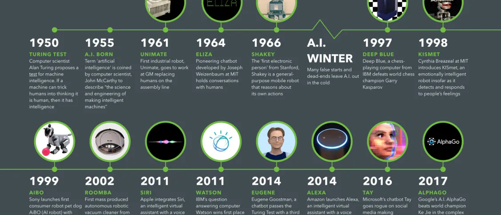
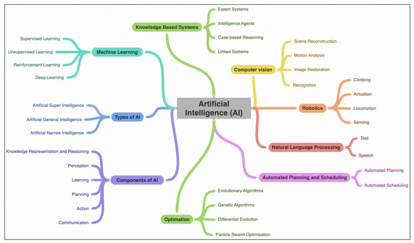

# Introduction to Artificial Intelligence (AI) :notebook:

---

## What is AI?
Artificial Intelligence (AI) is a branch of computer science aimed at creating systems capable of performing tasks that typically require human intelligence. These tasks include decision-making, language understanding, pattern recognition, problem-solving, and more. At its core, AI involves the creation of algorithms that can learn from data, adapt over time, and make predictions or classifications. Modern AI has evolved to include subfields such as machine learning, natural language processing, computer vision, and robotics.

---

## Uses of AI
AI is applied across diverse fields due to its adaptability and potential for automation and efficiency. Some notable applications include:
1. **Healthcare**: AI is used for diagnostics, personalized medicine, and predictive analytics (e.g., predicting disease outbreaks).
2. **Finance**: Fraud detection, algorithmic trading, and credit scoring leverage AI’s predictive power.
3. **Transportation**: Self-driving cars and route optimization use AI to make real-time decisions.
4. **Customer Service**: AI chatbots and virtual assistants handle customer inquiries and support interactions.
5. **Manufacturing**: Robotics and AI-driven automation optimize production lines, improving safety and efficiency【31†source】【25†source】.

*Instruction for image:* *(Consider a graphic showing AI applications in various industries like healthcare, finance, and customer service)*

---

## History of AI
The history of AI dates back to the mid-20th century with the pioneering work of scientists like Alan Turing, who explored the theoretical foundations of computation. Key milestones include:
- **1956**: The Dartmouth Conference marked the formal founding of AI as a field.
- **1970s-1980s**: AI research saw "AI winters" with reduced funding due to unmet expectations.
- **1990s-2000s**: Revitalized by advances in computational power and data availability, AI flourished with innovations in machine learning and statistical approaches.
- **2010s-present**: AI has achieved breakthroughs in deep learning and neural networks, demonstrated by achievements such as AlphaGo and GPT models【31†source】【38†source】.

---

## Significance of AI
AI holds transformative potential for society and industry. It can:
- **Improve Efficiency**: Automate routine tasks, freeing up human labor for more creative work.
- **Enhance Decision-Making**: AI systems analyze large datasets to support more informed decisions in real-time.
- **Enable Innovation**: New products and services, such as personalized recommendations and autonomous systems, are powered by AI.
- **Drive Economic Growth**: By enhancing productivity, AI contributes to growth across sectors.
- **Address Complex Challenges**: AI can tackle issues like climate modeling, pandemic response, and resource allocation in ways that were previously unmanageable【25†source】【39†source】.

*Instruction for image:* *(Illustrate examples of AI contributing to sectors like healthcare, finance, and environmental sustainability)*

---

## Key Concepts in AI
1. **Machine Learning (ML)**: The process where machines improve from data without explicit programming, essential for pattern recognition, predictions, and classification【37†source】【33†source】.
2. **Deep Learning**: A subset of ML that uses neural networks with multiple layers (e.g., CNNs and RNNs) to process complex data such as images and text【34†source】.
3. **Natural Language Processing (NLP)**: Enables machines to understand and generate human language, with applications in translation, sentiment analysis, and chatbots【39†source】.
4. **Reinforcement Learning**: An area where agents learn optimal actions by maximizing rewards in an environment, critical in robotics and game AI【32†source】.
5. **Computer Vision**: Allows machines to interpret and make decisions based on visual data, used in fields like healthcare diagnostics and autonomous vehicles【42†source】.

---

## Future Directions in AI
The field of AI is rapidly evolving, with a focus on areas such as:
- **Explainable AI (XAI)**: Developing models that offer transparency and interpretability to build trust.
- **Ethics and Bias Mitigation**: Addressing issues of fairness, accountability, and ethical considerations in AI use.
- **General AI**: Moving towards AI systems that possess broader, more adaptable intelligence (akin to human intelligence).
- **AI in Healthcare**: Expanding applications in diagnosis, treatment planning, and personalized medicine.
- **AI for Social Good**: Applying AI to tackle challenges like climate change, disaster response, and education accessibility【39†source】【31†source】.

*Instruction for image:* *(Consider an illustration representing the future directions and potential of AI, such as ethical AI and AI for social good)*

---
