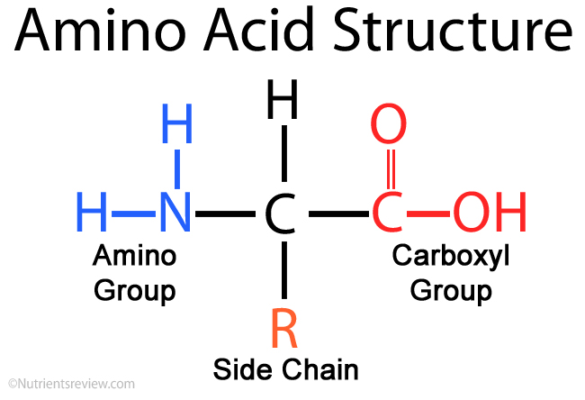
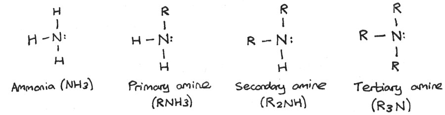
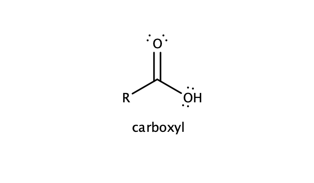

:::{.handwritten}
Chemical Analysis
:::

```{.code-block}
def ChemicalAnalysis(type,tissue){

	if (type=='Basic Chemical Method'){
	
		slurry = tissue.grind(Mortar & Pestle)
		slurry.add(Tri Chloro acetic Acid)
		filterate,retentate = slurry.strain()
		filterate.add-property(Acid Soluble faction)
		retentate.add-property(Acid Insoluble faction)
		
	}
	
	else if (type=='Complex Analysis'){
			tissue.[[MassSpectrometry]]()
	}
	
	else if (type == "Inorganic Analysis"){
			wet-weight = tissue.weigh()
			tissue.dry() # tissue - water
			dry-weight = tissue.weigh()
			ash = tissue.burn() # tissue - carbon compounds
			ash.content() # Ca , Mg etc.
	}
	
	else{
			 tissue no shit !
	}

}
```


:::{.sticky-note}
There are many ways for analysis of tissues. This is the basic in NCERT books 
:::

:::{.handwritten}
Amino Acids
:::

```{.code-block}
def AminoAcids(Ligand,size,nature){

	extends Compounds()

	def1 = contain.AmineGroup() --> C1

	def2 = contain.CarboxylAcid() --> C1

	C1 = α carbon = attach point for everything

	C1.ValancePosition(){
		- Hydrogen() --> H
		- AmineGroup() --> NH₂
		- VariableGroup() --> R
		- CarboxylGroup() --> COOH
	}
	
	__self__.depends(R)
}
```

`` AminoAcids.display() ``



`` AmineGroup.display() ``



`` CarboxylAcid.display() ``



:::{.handwritten}
Types of Amino Acids
:::

```{.code-block}
def TypesOfAminoAcids(AminoAcids(),R){

	if(Body.produce=True){
		AminoAcid.type = Non-Essential Amino Acid
		if (R==''){
		
		}
	}
	
	else if(Body.produce=False){
		AminoAcid.type = Essential Amino Acid
		
		if(R=='-CH(CH₃)₂'){
			-Isoleucine(lle)
				R group : Isopropyl Group
				Nature :  a non-polar, uncharged (at physiological pH), branched-chain, aliphatic
				Function : Necessary for the synthesis of hemoglobin. Related to insulin resistence ,boosting up energy level
				IUPAC : (2S,3S)-2-Amino-3-methylpentanoic acid
		}
		
		if(R=='−C4H9'){
			- Leucine(Leu)
				R group : Isobutyl Group
				Nature : a non-polar, uncharged (at physiological pH), branched-chain, aliphatic 
				Function : Regulates Blood sugar , promotes growth and repair , production of growth hormone 
				IUPAC : (2S)-2-Amino-4-methylpentanoic acid
		}
		
		if(R=='(CH2)4NH2'){
			-Lysine 
				R group : 1-aminobutane or butylamine 
				Nature : basic aliphatic.
				Function : calcium absorbtion , recovery from surgery , muscle protein
				IUPAC : (2S)-2,6-DSiaminohexanoic acid
		}
		
		if(R=='')
	
	}
	
	else{
		AminoAcid.type = Semi-Essential Amino Acid
		
		if(R=='heterocyclic'){
			- Histidine(His)
				R group: CH₂-imidazole (aromatic ring with nitrogen)
				Nature : Basic ; (+) charge ; aromatic 
				Function :  Found in high concentrations in hemoglobin. Treats anemia, has been used to treat rheumatoid arthritis.
				IUPAC : (2S)-2-Amino-3-(3H-imidazol-4-yl)propanoic acid
		}
		
		if(R=='Basic'){
			- Arginine(Arg)
				R group: CH₂CH₂CH₂NHC(NH₂)₂ (guanidino group)
				Nature : Basic ; (+) charge ; aromatic 
				Function : Tissue repair 
				IUPAC :  (2S)-2-Amino-5-(diaminomethylideneamino)pentanoic acid
		}
	
	}
}

TypesOfAminoAcids.addContext('In Human Body')
```

``Isoleucine.display``


``Leucine.display``


``Lycine.display``


``Histidine.display()``


``Arginine.display()``


### Essential Amino Acids  
| **Amino Acid**    | **3-Letter Code** | **R Group**                                   | **Diagram**                                                    |
|-------------------|-------------------|-----------------------------------------------|:-------------------------------------------------------------:|
| Isoleucine        | Ile               | $$CH(CH_3)(CH_2CH_3)$$                        |  |
| Leucine           | Leu               | $$CH_2CH(CH_3)_2$$                            |       |
| Lysine            | Lys               | $$CH_2CH_2CH_2CH_2NH_2$$                      |         |
| Methionine        | Met               | $$CH_2CH_2SCH_3$$                             | |
| Phenylalanine     | Phe               | $$CH_2(C_6H_5)$$                              |  |
| Threonine         | Thr               | $$CH(OH)CH_3$$                                |   |
| Tryptophan        | Trp               | $$CH_2-\text{indole ring}$$                   |  |
| Valine            | Val               | $$CH(CH_3)_2$$                                |         |

### Non-Essential Amino Acids  
| **Amino Acid**    | **3-Letter Code** | **R Group**                                   | **Diagram**                                                    |
|-------------------|-------------------|-----------------------------------------------|:-------------------------------------------------------------:|
| Alanine           | Ala               | $$CH_3$$                                      |      |
| Asparagine        | Asn               | $$CH_2CONH_2$$                                |  |
| Aspartic Acid     | Asp               | $$CH_2COOH$$                                  |  |
| Glutamic Acid     | Glu               | $$CH_2CH_2COOH$$                              |  |
| Serine            | Ser               | $$CH_2OH$$                                    |        |
| Proline           | Pro               | $$CH_2CH_2CH_2$$ (cyclic, bound to amine)     |      |
| Cysteine          | Cys               | $$CH_2SH$$                                    |    |
| Glutamine         | Gln               | $$CH_2CH_2CONH_2$$                            |  |
| Tyrosine          | Tyr               | $$CH_2(C_6H_4OH)$$                            |    |

### Semi-Essential Amino Acids  
| **Amino Acid**    | **3-Letter Code** | **R Group**                                   | **Diagram**                                                    |
|-------------------|-------------------|-----------------------------------------------|:-------------------------------------------------------------:|
| Arginine          | Arg               | $$CH_2CH_2CH_2NHC(NH_2)_2$$ (guanidino group) |   |
| Histidine         | His               | $$CH_2-\text{imidazole ring}$$                | |


:::{.pencil-line}
:::

:::{.sources}

### Sources 
- Diagrams sourced from [Amino Acids Guide](https://aminoacidsguide.com).
- Information from NCERT Biology Grade 11 book 
- Truman Elementary Biology

:::
