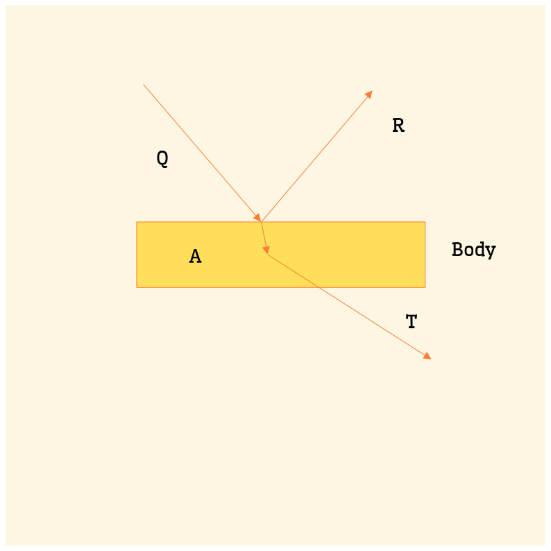

The Thermal Radiation are those , which produce in us the sensation of warmth . They are emitted by a body on account of it's temperature. Every body whose temperature is above 0 K emits thermal radiation . The radiation emitted depends upon 2 factors :-

1. The temperature of the body.
2. The nature of the radiating surface of the body.

The wavelength of thermal radiations ranges from $700 \mu m$ to $1 mm$ ; they belong to the infra-red regions , $∴$ thermal radiations are also called infrared radiation .

---

## Basic Characteristics of Thermal Radiations
(same as emv)

1. They travel with speed or light along straight line .
2. They require no medium for their propagation , so they can travel through vacumn.
3. They do not hit the intertwining medium through which they travel
4. They obey the inverse square law.
5. [They can be reflected and refracted according to laws of reflection and refraction of light.]{.highlight}
6. Inhibit the phenomenon of interference , diffraction and polarization.

---

## Reflectence Absorbtance & Transmittence 

$Q = R + A + T$

(dividing throughout by Q)

$\frac{Q}{Q}=\frac{R}{Q}+\frac{A}{Q}+\frac{T}{Q}$

$\implies 1=r+a+t$

Here :

- $Q:$ Amount of thermal radiation incident on a body at a given time.
- $R=$ Amount of thermal radiation reflected by the body in the same time.
- $A=$ Amount of thermal radiation absorbed by the body in the same time.
- $T=$ Amount of thermal radiation transmitted by the body in the same time.
- $r=$ Reflectance/Reflective power of the body.
- $a=$ Absorbance/Absorbing power of the body.
- $t=$ Transmittance/Transmitting power of the body.

---

:::{.note}

## Discussion

We know that:
$$r+a+t=1$$
If the body does not transmit any heat radiation then , $t=0$
$∴r+a=1$

If $r>>a$ & vise versa , i.e. a good reflector and a bad absorber and vise versa .

It is found that $r,a,t$ of a body depends upon two factors:-

1. The nature of the surface of the body .
2. Wavelength of the incident radiation.

[They do not depend upon nature of the material of the body]{.sticky-note}

:::

---

[Monochromatic Emittance:]{.tag} Monochromatic emittance of a body corresponding to a particular wavelength λ at a particular temperature is defined as the radiant energy emitted per unit time per unit surface area of the body within unit wavelength interval around λ , i.e.

$$(λ-\frac{1}{2})\leftarrow λ \rightarrow (λ+\frac{1}{2})$$

Represented by $(e_λ)$

---

### Emissive Power / Total emittance:

The emissive power of a body at a given temperature is defined as the total amount of thermal energy emitted per unit time ; per unit area of the body for all possible wavelengths $(700 μm → 1 mm)$, represented by $e$ :-

$$e=\int_{λ=0}^{λ=∞} = e_λ \cdot d_λ$$

SI unit is $= \frac{J}{s \cdot m^2}$
$=\frac{W}{m^2}$

---

### Emissivity(ϵ):-

The emissivity of a body is defined as the ratio of total emissive power of a body $(e)$ to the total emissive power of a perfectly black body $(E)$ at that temperature .

$$[ϵ=\frac{e}{E}]  [\text{Unit-less}]$$

---

:::{.change-page}
[Next Day](./03-01-2025.html)
:::
:::{.change-page}
[Previous Day](./01-01-2025.html)
:::